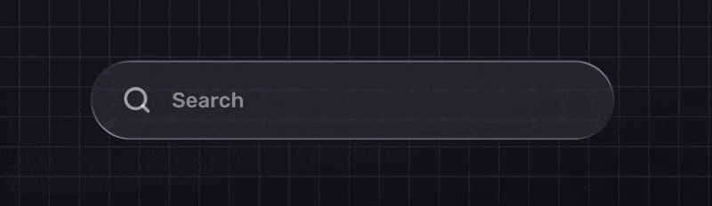
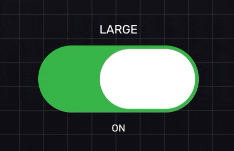
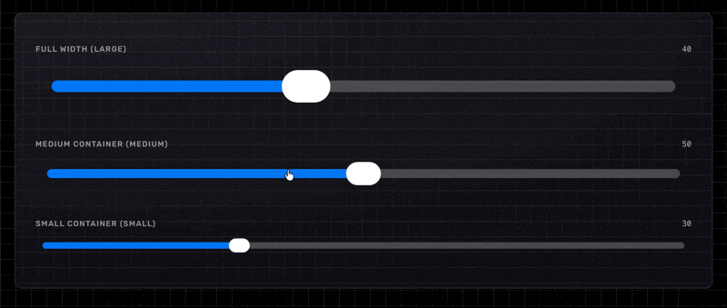
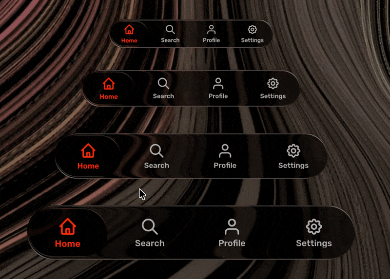

# Liquid Glass Vue — Apple-Inspired Web Components

An open-source **Vue 3** UI experiment exploring **liquid glass / frosted glass** effects inspired by Apple’s design language, built with modern web standards.

This project focuses on **translucency, blur, depth, and motion** using **CSS, SVG filters, and Vue 3** — without canvas or WebGL.

---

## ✨ Features

- Apple-inspired liquid glass visuals
- Translucent layers with realistic blur
- SVG-based refraction and distortion
- Smooth, natural animations
- Lightweight and dependency-free
- Reusable, framework-friendly **Vue** components

---

## 🧠 Motivation

Apple’s interfaces demonstrate a high level of visual refinement through subtle glass effects and motion.

This project exists to:

- Study and understand liquid glass principles
- Recreate similar effects using **pure web technologies** and **Vue 3**
- Share learnings with the open-source community

It is **not a clone**, but a technical and visual exploration.

---

## 🛠 Tech Stack

- **Vue 3** (Composition API)
- **CSS** (filters, masks, blend modes)
- **SVG filters** for advanced glass effects
- **Vite** for fast development

No UI frameworks or design systems are used.

---

## 📦 Installation

```bash
git clone https://github.com/mkj0kjay/vue-web-liquid-glass.git
cd vue-web-liquid-glass
npm install
npm run dev
```

---

## 🧩 Vue Components

The project includes a growing set of **Vue 3** glass-based components, such as:

- Liquid glass containers
- Navigation elements
- Panels and surfaces
- Interactive glass effects

Each component is:

- Self-contained
- Customizable
- Built with performance in mind

---

## 🎬 Demo

<table>
  <tr>
    <td align="center">
      
      <br />
      <strong>Searchbox</strong>
    </td>
    <td align="center">
      
      <br />
      <strong>Toggle Switch</strong>
    </td>
  </tr>
  <tr>
    <td align="center">
      
      <br />
      <strong>Slider</strong>
    </td>
    <td align="center">
      
      <br />
      <strong>Bottom NavBar</strong>
    </td>
  </tr>
</table>

---

## 📚 References & Credits

This project was heavily inspired by the following article:

**Liquid Glass with CSS & SVG**  
<https://kube.io/blog/liquid-glass-css-svg/>

Some components and techniques are adapted from concepts demonstrated in the article and then extended and integrated into this project.

Full credit to the original author for the research and experimentation.

---

## ⚠️ Browser & Performance Notes

- **Currently works only in Chrome**
- Visual results may vary depending on GPU and OS
- SVG filters can be GPU-intensive in large quantities

---

## 🚧 Project Status

This project is **experimental** and under active development.

Breaking changes may occur as visuals, APIs, and performance are refined.

---

## 📄 Disclaimer

- Apple-inspired, **not affiliated with Apple**
- No Apple assets or proprietary designs are used
- All trademarks belong to their respective owners

---

## 🤝 Contributing

Contributions are welcome.

You can help by:

- Improving realism or performance
- Adding new glass components
- Refactoring for clarity
- Testing across browsers

Please open an issue or submit a pull request.

---

## 🚀 Roadmap & Contribution Note

This project is still **early-stage** and requires **a lot of work and experimentation** to reach higher visual accuracy, better performance, and a more complete component set.

There is plenty of room for:

- Improving realism and motion fidelity
- Optimizing SVG and CSS performance
- Adding new liquid glass components
- Refining APIs and customization options

If you’re interested, feel free to:

- **Fork the project**
- **Open issues with ideas or findings**
- **Submit pull requests with your improvements**

Any contribution, big or small, is welcome and appreciated.

---

## 📜 License

MIT License — feel free to use, modify, and share.

---

## ⭐ Support

If you find this project useful or interesting, consider giving it a star.
It helps the project grow and reach more developers.

[](https://www.patreon.com/15295508/join)
